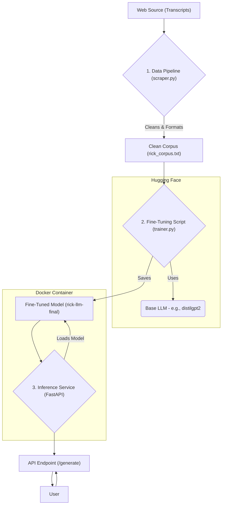

# Character LLM Factory 🤖📝🎤

[](https://github.com/PRYSKAS/character_llm_factory/actions)

This project demonstrates the complete MLOps lifecycle in practice, from raw data collection to the deployment of a containerized inference service. The goal was to build a "factory" for fine-tuning Large Language Models (LLMs) to learn to speak like a specific character—in this case, Rick Sanchez from Rick and Morty.

## 🚀 Engineering & MLOps Highlights

This project is not just about fine-tuning; it's a case study on building an end-to-end, robust, and reproducible AI system.

* **Automated Data Pipeline (ETL):** A scraper built with `requests` + `BeautifulSoup` extracts, transforms (cleans and formats), and loads Rick and Morty scripts into a clean text corpus ready for training.
* **LLM Fine-Tuning:** Leverages the **Hugging Face** ecosystem (`transformers`, `datasets`, `accelerate`) to fine-tune a base model (`distilgpt2`) on the custom dataset, teaching it to capture the character's style and personality.
* **Optimized Inference Service:** The fine-tuned model is served via a high-performance **FastAPI** service. The model is loaded **only once** on application startup to ensure low-latency requests.
* **Containerization for Portability:** The inference application, including the trained model artifact, is packaged into a **Docker** image, ensuring the service is portable and can run consistently in any environment. Optimized with a `.dockerignore` file.
* **CI/CD & Code Quality:** A **GitHub Actions** pipeline validates the API code's quality (`Ruff`) and correctness (`Pytest`) on every push, ensuring service integrity.

## 🏗️ The MLOps Lifecycle

This project implements the key phases of an MLOps pipeline for custom model creation:



## 🏁 Getting Started

### Prerequisites
* Git, Python 3.9+, Docker Desktop

### Option 1: Run the Pre-Trained Service (Recommended)

This option uses the already fine-tuned model included in this repository.

1.  **Clone the repository:**
    ```bash
    git clone [https://github.com/PRYSKAS/character_llm_factory.git](https://github.com/PRYSKAS/character_llm_factory.git)
    cd character_llm_factory
    ```
2.  **Build the Docker image:**
    ```bash
    docker build -t rick-llm-service .
    ```
3.  **Run the container:**
    ```bash
    docker run -d -p 8001:8001 --name rick-llm rick-llm-service
    ```
    Access the API at `http://127.0.0.1:8001/docs` to interact with the Rick LLM.

### Option 2: Recreate the Model (The Full Pipeline)

Follow these steps if you want to run the data pipeline and fine-tuning process from scratch.

1.  **Clone and install dependencies:**
    ```bash
    git clone [https://github.com/PRYSKAS/character_llm_factory.git](https://github.com/PRYSKAS/character_llm_factory.git)
    cd character_llm_factory
    pip install -r requirements.txt
    ```
2.  **Run the Data Pipeline:**
    ```bash
    python -m data_pipeline.scraper
    ```
    This will generate the `rick_corpus.txt` file.

3.  **Run the Fine-Tuning Process:**
    ```bash
    python -m finetuning.trainer
    ```
    This will train the model and save the artifacts in the `rick-llm-final` folder.

4.  **Start the inference service locally:**
    ```bash
    uvicorn serving.main:app --reload --port 8001
    ```
---